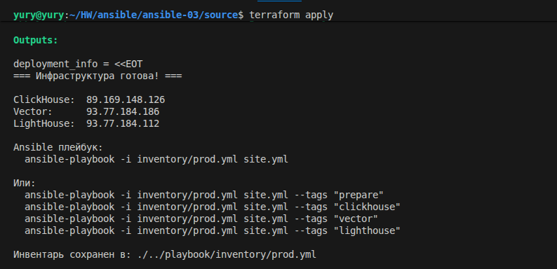
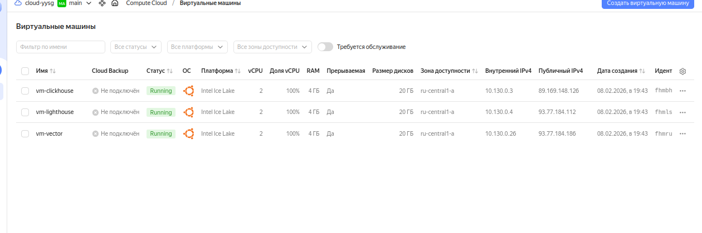
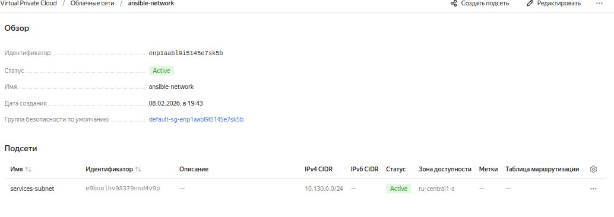
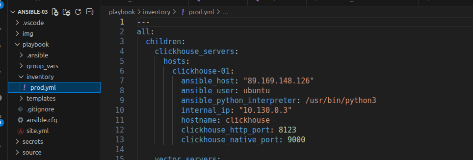
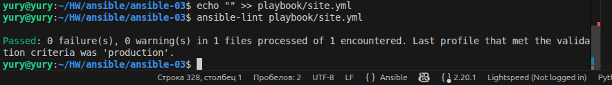
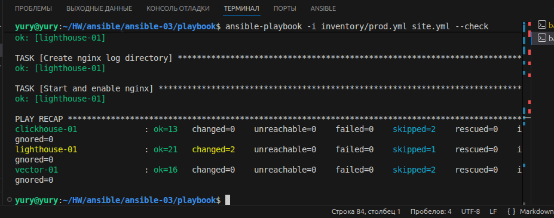
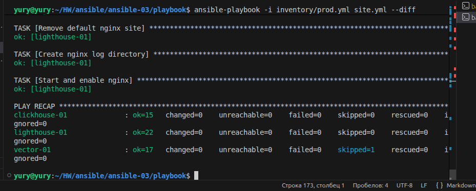
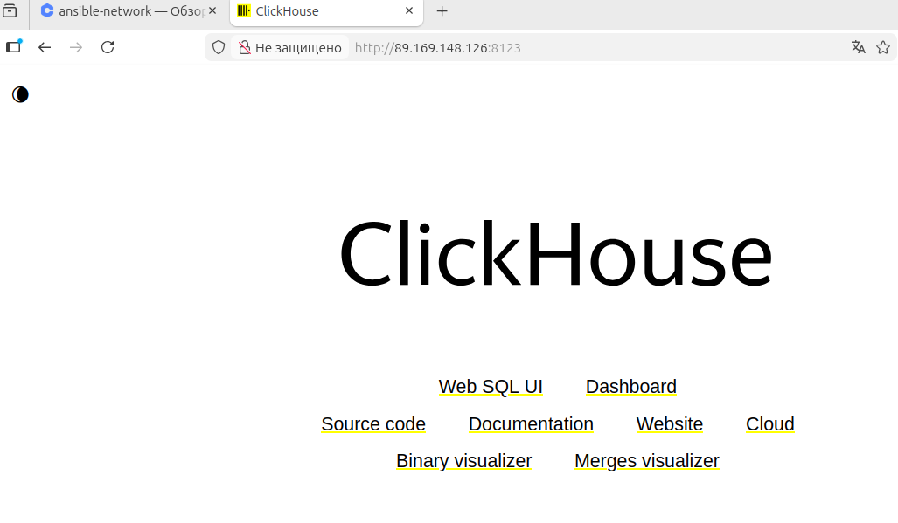

# Домашнее задание к занятию 3 «Использование Ansible». Шелухин Юрий.

## Подготовка к выполнению

1. Подготовьте в Yandex Cloud три хоста: для `clickhouse`, для `vector` и для `lighthouse`.

#  
Для создания ВМ будем использовать terraform. Ввиду простоты задачи бастион не используем. Для маштабирования будем использовать locals.





2. Репозиторий LightHouse находится [по ссылке](https://github.com/VKCOM/lighthouse).

## Основная часть

1. Допишите playbook: нужно сделать ещё один play, который устанавливает и настраивает LightHouse.
2. При создании tasks рекомендую использовать модули: `get_url`, `template`, `yum`, `apt`.
3. Tasks должны: скачать статику LightHouse, установить Nginx или любой другой веб-сервер, настроить его конфиг для открытия LightHouse, запустить веб-сервер.

#  
Возьмем за основу playbook из предыдущего задания и дополним его тасками для открытия LightHouse. Установим веб-сервер Nginx. 


4. Подготовьте свой inventory-файл `prod.yml`.

#
Сформируем `prod.yml` при развертывании инфраструктуры terraform с помощью шаблона.

```
all:
  children:
    clickhouse_servers:
      hosts:
        clickhouse-01:
          ansible_host: "89.169.148.126"
          ansible_user: ubuntu
          ansible_python_interpreter: /usr/bin/python3
          internal_ip: "10.130.0.3"
          hostname: clickhouse
          clickhouse_http_port: 8123
          clickhouse_native_port: 9000

    vector_servers:
      hosts:
        vector-01:
          ansible_host: "93.77.184.186"
          ansible_user: ubuntu
          ansible_python_interpreter: /usr/bin/python3
          internal_ip: "10.130.0.26"
          hostname: vector
          vector_version: "0.31.0"

    lighthouse_servers:
      hosts:
        lighthouse-01:
          ansible_host: "93.77.184.112"
          ansible_user: ubuntu
          ansible_python_interpreter: /usr/bin/python3
          internal_ip: "10.130.0.4"
          hostname: lighthouse
          web_port: 80

    database_servers:
      children:
        clickhouse_servers:

    monitoring_servers:
      children:
        vector_servers:
        lighthouse_servers:

    logging_stack:
      children:
        clickhouse_servers:
        vector_servers:

  vars:
    ansible_ssh_common_args: '-o StrictHostKeyChecking=no'
```




5. Запустите `ansible-lint site.yml` и исправьте ошибки, если они есть.

#
Результат работы линтера:
```           
ansible-lint playbook/site.yml
WARNING  Listing 30 violation(s) that are fatal
yaml[trailing-spaces]: Trailing spaces
playbook/site.yml:8
yaml[truthy]: Truthy value should be one of [false, true]
playbook/site.yml:12
yaml[truthy]: Truthy value should be one of [false, true]
playbook/site.yml:35
yaml[truthy]: Truthy value should be one of [false, true]
playbook/site.yml:42
yaml[truthy]: Truthy value should be one of [false, true]
playbook/site.yml:61
yaml[trailing-spaces]: Trailing spaces
playbook/site.yml:68
name[missing]: All tasks should be named.
playbook/site.yml:77 Task/Handler: block/always/rescue 
yaml[truthy]: Truthy value should be one of [false, true]
playbook/site.yml:89
yaml[truthy]: Truthy value should be one of [false, true]
playbook/site.yml:99
fqcn[action-core]: Use FQCN for builtin module actions (meta).
playbook/site.yml:103:11 Use `ansible.builtin.meta` or `ansible.legacy.meta` instead.
yaml[trailing-spaces]: Trailing spaces
playbok/site.yml:132
no-changed-when: Commands should not change things if nothing needs doing.
playbook/site.yml:134 Task/Handler: Restart vector service
yaml[trailing-spaces]: Trailing spaces
playbook/site.yml:142
yaml[trailing-spaces]: Trailing spaces
playbook/site.yml:156
yaml[truthy]: Truthy value should be one of [false, true]
playbook/site.yml:162
yaml[trailing-spaces]: Trailing spaces
playbook/site.yml:168
yaml[trailing-spaces]: Trailing spaces
playbook/site.yml:175
yaml[trailing-spaces]: Trailing spaces
playbook/site.yml:183
yaml[trailing-spaces]: Trailing spaces
playbook/site.yml:188
command-instead-of-module: systemctl used in place of systemd module
playbook/site.yml:189 Task/Handler: Reload systemd to detect new service
no-changed-when: Commands should not change things if nothing needs doing.
playbook/site.yml:189 Task/Handler: Reload systemd to detect new service
yaml[trailing-spaces]: Trailing spaces
playbook/site.yml:193
yaml[trailing-spaces]: Trailing spaces
playbook/site.yml:201
yaml[trailing-spaces]: Trailing spaces
playbook/site.yml:217
yaml[truthy]: Truthy value should be one of [false, true]
playbook/site.yml:231
risky-file-permissions: File permissions unset or incorrect.
playbook/site.yml:256 Task/Handler: Create LightHouse CSS directory
risky-file-permissions: File permissions unset or incorrect.
playbook/site.yml:262 Task/Handler: Create LightHouse JS directory
risky-file-permissions: File permissions unset or incorrect.
playbook/site.yml:268 Task/Handler: Create LightHouse IMG directory
yaml[new-line-at-end-of-file]: No new line character at the end of file
playbook/site.yml:324
yaml[truthy]: Truthy value should be one of [false, true]
playbook/site.yml:324
Read documentation for instructions on how to ignore specific rule violations.
# Rule Violation Summary
  1 command-instead-of-module profile:basic tags:command-shell,idiom
  1 name profile:basic tags:idiom
  1 yaml profile:basic tags:formatting,yaml
 12 yaml profile:basic tags:formatting,yaml
  9 yaml profile:basic tags:formatting,yaml
  3 risky-file-permissions profile:basic tags:unpredictability
  2 no-changed-when profile:basic tags:command-shell,idempotency
  1 fqcn profile:basic tags:formatting
Failed: 30 failure(s), 0 warning(s) in 1 files processed of 1 encountered. Last profile that met the validation criteria was 'min'.
```
Исправим ошибки, вновь запустим линтер.



6. Попробуйте запустить playbook на этом окружении с флагом `--check`.

#



7. Запустите playbook на `prod.yml` окружении с флагом `--diff`. Убедитесь, что изменения на системе произведены.

#



8. Повторно запустите playbook с флагом `--diff` и убедитесь, что playbook идемпотентен.

#


9.  Подготовьте README.md-файл по своему playbook. В нём должно быть описано: что делает playbook, какие у него есть параметры и теги.

# 
Описание плейбука:

Состоит из 4 частей:
1. Prepare all hosts — подготовка всех хостов.
Тег: prepare. Назначение: Базовая настройка всех узлов инфраструктуры.
2. Install ClickHouse — установка ClickHouse.
Тег: clickhouse. Назначение: Установка и настройка ClickHouse сервера
3. Install and configure Vector — установка Vector.
Тег: vector. Назначение: Установка и настройка Vector для сбора логов.
4. Install and configure LightHouse — установка Lighthouse.
Тег: lighthouse. Назначение: Развёртывание веб-интерфейса для визуализации логов.

Задачи (tasks):

1. Prepare all hosts — подготовка всех хостов:
- Обновление кэша пакетов APT
- Установка базовых утилит (python3, curl, wget, unzip)
- Ожидание завершения cloud-init
- Создание пользователя ansible с правами sudo
- Настройка SSH-доступа для пользователя ansible
  
2. Install ClickHouse — установка ClickHouse:
- Добавление GPG-ключа и репозитория ClickHouse
- Установка пакетов (clickhouse-server, clickhouse-client)
- Создание базы данных 'logs'
- Настройка прослушивания на всех интерфейсах (0.0.0.0)
- Перезапуск службы после изменений конфигурации
  
3. Install and configure Vector — установка Vector:
- Установка Vector из официального репозитория
- Создание структуры каталогов для конфигурации
- Развёртывание конфигурационного шаблона vector.yml.j2
- Автоматическое определение типа инициализации (systemd/контейнер)
- Запуск и включение службы Vector

4. Install and configure LightHouse — установка Lighthouse:
- Установка и настройка nginx
- Загрузка файлов Lighthouse с GitHub
- Настройка статического веб-сервера
- Обновление конфигурации для подключения к ClickHouse
- Замена дефолтного сайта nginx на Lighthouse

Playbook использует хосты из inventory:
- clickhouse_servers:  
- vector_servers:      
- lighthouse_servers:  

После выполнения:
- ClickHouse: доступен на порту 8123 (HTTP) и 9000 (Native)
- Vector: работает как служба systemd
- Lighthouse: доступен через браузер по адресу хоста Lighthouse




10.  Готовый playbook выложите в свой репозиторий, поставьте тег `08-ansible-03-yandex` на фиксирующий коммит, в ответ предоставьте ссылку на него.


Изначально мною была выбрана неправильная идея часть настройки хостов отдать в provisioner-exec, но cтолкнулся с зависанием установки SSH, поэтому все конфигурирование переместил в плейбук.


---